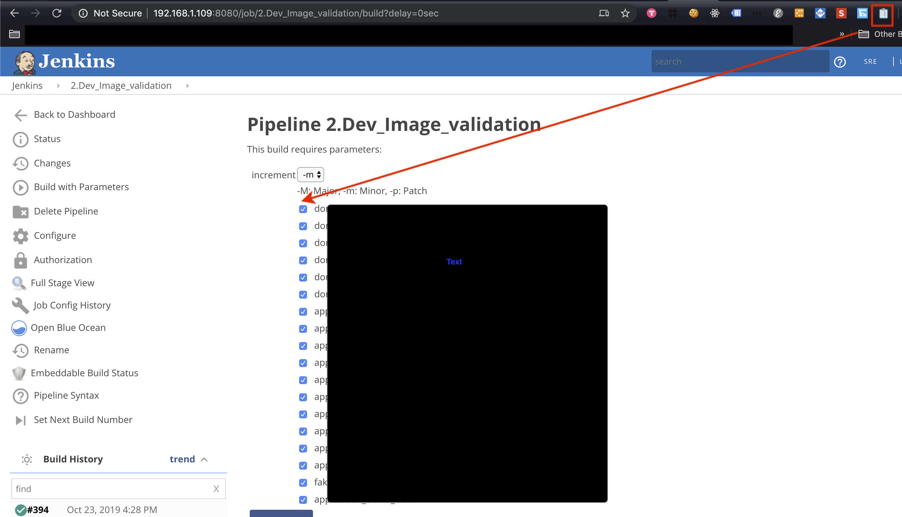

# Chrome Extension - Jenkins Check All 

## Setup Flow

1. Download [jenkin_checkedall_extensions.zip](jenkin_checkedall_extensions.zip) and unzip files
2. Open Chrome and goto [chrome://extensions/](chrome://extensions/) and click `Load Unpacked`

    

3. Choose `jenkin_checkedall_extensions` directory

## How to use it

Click it when you focus the page with check box on Jenkins.

